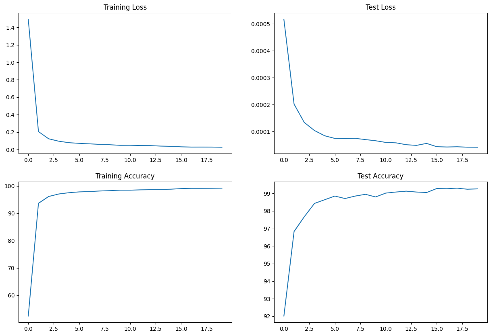

# ERAv2-Assignment5

## Objective
To train a simple CNN on FashionMNIST dataset using Pytorch libraries

## File Structure
- The model has been implemented in [model.py](model.py) file
- The config and other utility functions have been implemented in [utils.py](utils.py) file
- All the dataset related functionality, plus train and test functions have been implemented in [Session_5.ipynb](Session_5.ipynb) file for ease of debugging and better modularity of code.

## Performance
The performance of the training algorithm is as follows:

